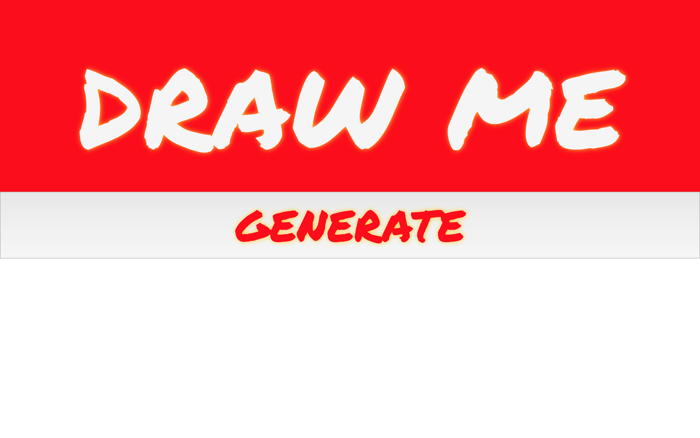
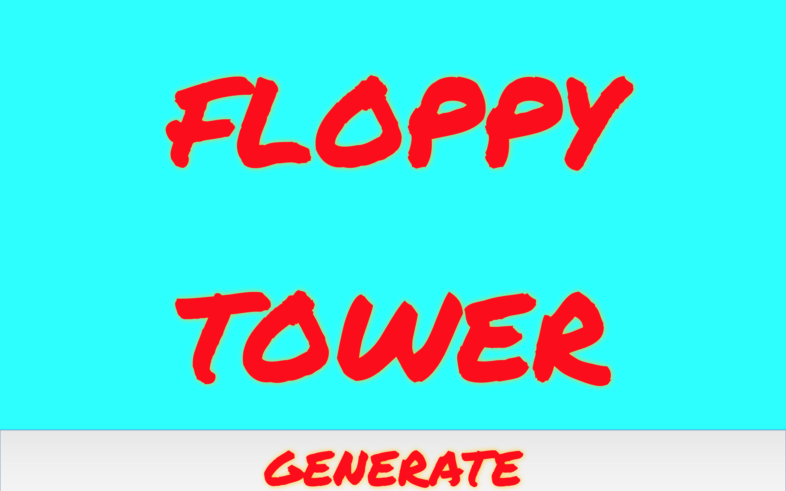

# Draw Me

## Objective
    - An app that generates ideas for users to quickly sketch.

## Technologies Used
    - React.JS
    - CSS
    - HTML
    - JavaScript

## User Stories
    - AAU I want to be given random ideas to sketch.
    - AAU I want a simple, intuitive interface.

## Stretch Goals
    - Upload sketches and view others.
    - Add nice drawing music.
    - Add a link to have wine delivered while sketching.

## Screenshots
    - Screenshot of landing page:

    - Screenshot of sketch idea:

## Deployed Link
[Surge Link](drawme.surge.sh)